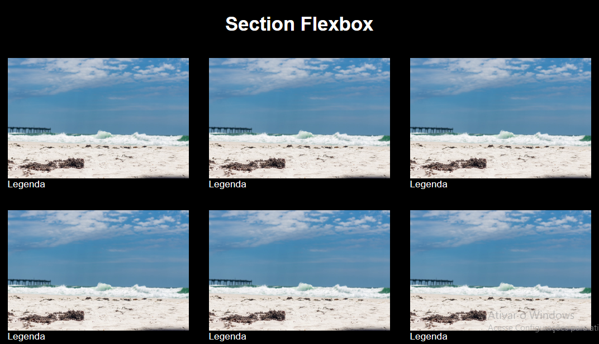

<h1 align="center">CSS Grid e Flexbox</h1>

Estudando CSS Grid e Flexbox para desenvolver minhas habilidades na programação.

  <a href="#-tecnologias">Tecnologias</a>&nbsp;&nbsp;&nbsp;|&nbsp;&nbsp;&nbsp;
  <a href="#-projeto">Projeto</a>&nbsp;&nbsp;&nbsp;|&nbsp;&nbsp;&nbsp;
  <a href="#-layout">Layout</a>&nbsp;&nbsp;&nbsp;|&nbsp;&nbsp;&nbsp;
  <a href="#memo-licença">Licença</a>

  

 

  

## 🚀 Tecnologias

Esse é um estudo desenvolvido com as seguintes tecnologias:

- HTML e CSS
<!-- - JavaScript e JSON
- [Node e NPM](https://nodejs.org/)
- [Vite](https://vitejs.dev/)
- [iMask](https://imask.js.org) -->

## 💻 Projeto

Esse é um estudo para aprimorar minhas habilidades em CSS com Grid e Flexbox, um projeto simples de executar e responsivo, estudo com tecnologias voltadas para web.

## 🔖 Layout

Você pode praticar através [DESSE LINK](https://www.youtube.com/watch?v=x-4z_u8LcGc).

## :memo: Licença

Esse projeto está sob a licença MIT.

## Atualmente estudando

 
 
 
  ## Meus contatos
 

 
  
  
  
  
  
  
            
          
          
 
  

---
Feito com ♥ by Rodrigo Oliveira :wave:

